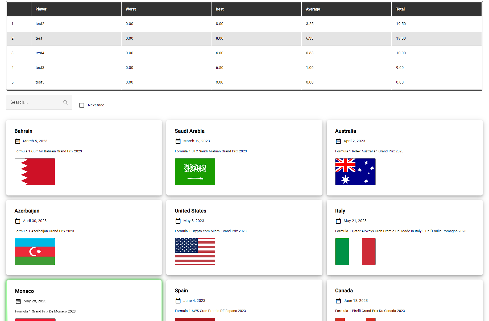

# F1 Racing App

This project is an app for predicting the results of Formula 1 races. It contains the customer app, where users can join groups and play together, as well as the admin app, where the admin can provide race results and supervise the entire system.


## Tech stack

Angular, Nest.js, Typescript, TypeORM, MySQL
## Screenshots




## Database schema


## Run Locally

Clone the project

```bash
  git clone https://github.com/piotrv1001/Shop.git
```

Go to the project directory

```bash
  cd Shop
```

In the first terminal, go to the backend folder

```bash
  cd backend
```

Start the server

```bash
  npm run start
```

In the second terminal, go to the frontend folder

```bash
  cd frontend
```

Start the application

```bash
  ng serve --open
```

<i>Note: This requires to have a local MySQL database running on port 3306.</i>

## Features

- JWT Authentication
- Creating and joining groups
- Creating and updating race predictions
- Statistics table for each group
- Admin app for providing race results

